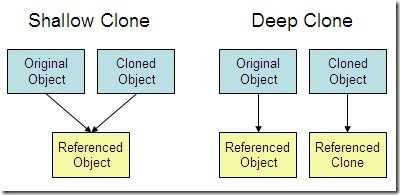

# 12장: 클래스와 동적 메모리 대입

## 대입 연산자 
- 객체에 객체를 대입할때 사용되는 연산자
- 기존의 대입 연산자(int = 0; 에서 '='이 대입 연산자였음)에서 그 범위가 객체까지 확장된 것으로 보면 됨. 객체에 객체를 대입하는 연산자가 정의되지 않으면 프로그램에서 객체를 위한 디폴트 대입 연산자를 정의함
- 객체를 초기화(선언 및 대입)할때 항상 사용되는건 아님
- ex) StringBad metoo = knot; 라는 코드가 있으면 
1. 복사 생성자를 사용하여 임시 객체를 먼저 생성한다
2. 대입 연산자를 사용하여 값들을 새로운 객체에 복사한다
   

## 복사 생성자
- 한 객체의 내용을 다른 객체로 복사하여 생성된 생성자
- 객체의 멤버들을 전부 복사하여 다른 객체에 넣는다. 단 static은 객체 생성과 상관없이 반드시 단 하나만 존재하므로 복사 대상에 포함하지 않는다.
- 자신과 같은 자료형의 객체를 인자로 받는 생성자이기 때문에, 사용자가 직접 입력한 값을 받아 아예 새로운 객체를 생성하는 생성자와는 대비됨
- 사용자가 정의한 복사 생성자가 없으면 디폴트 복사 생성자가 자동으로 생성
- 복사 생성자 함수 형식: Test(const & obj)  -> Test는 클래스, obj는 객체가 들어올 함수 인자임.
- 인자로 기존에 존재하던 객체를 받아 이를 복사한 객체를 만드는 것이 복사 생성자임. 여기서 참조형으로 인자를 받는 이유는 인자를 값으로 전달 시 객체의 복사본이 생성되는데(객체의 복사본을 생성하는 것도 복사기 때문에 복사 생성자가 사용됨)이는는 비효율적이기 때문에 참조를 사용하여 원본 객체의 값을 직접 인자로 가지고 온다고 생각하면 됨.
- const를 사용하는 이유는 어차피 복사 생성자는 객체의 멤버들을 변경할 일이 없는, 그저 생성자에 불과하기 때문에 const를 사용하여 값을 변경하지 않겠다고(즉, 읽기전용 데이터로 취급하겠다고) 선언한 것임.
- 
- 위 이미지처럼 얕은 복사는 원본 객체와 복사된 객체가 서로 같은 참조값을 지시한다(주소가 같음, 지시하는 메모리 같음, 한 객체가 메모리 삭제하면 다른 객체에도 영향 끼침침)
- 이와 달리 깊은 복사는 원본 객체와 복사된 객체가 서로 별도의 참조값을 가진다(주소 다름, 지시하는 메모리 서로 다름, 한 객체가 메모리 삭제해도 다른 메모리에는 영향 X)
- 보통 디폴트 복사 생성자는 얕은 복사만 가능하고, 사용자 정의 복사 생성자는 사용자의 선택에 따라 얕은 복사, 깊은 복사 둘다 가능하다.
- 복사 생성자가 사용될때: 어떤 함수가 객체를 값으로 전달하거나 함수가 객체를 반환할때, 임시 객체가 생성될때 복사 생성자가 사용됨.
- 디폴트 복사 생성자는 생성자와 별개의 함수이므로 생성자 함수에 객체의 수를 세는 코드를 작성했다면 디폴트 복사 생성자로 생성된(복사된) 객체는 카운팅 되지 않음(기존 생성자 함수가 아니라 복사 생성자 함수에서 반환됐으므로)
- 만약 복사 생성자로 복사된 객체도 카운팅에 넣고 싶다면 사용자가 직접 복사 생성자 함수를 정의해서 그 안에 객체 수 카운팅 코드를 작성하면 됨(즉, 사용자 정의 복사 생성자를 만들면 됨).
- 프로그램 실행 후 파괴자가 객체를 파괴할때 복사된 객체도 객체로 간주하여 파괴하는데, 디폴트 복사 생성자가 존재한다면 얕은 복사를 하여 객체의 주소만 복사하여, 원본 객체와 같이 그 멤버들을 지시하는 포인터로서 작용함. 
## 주소 연산자
- 주소 연산자는 호출한 객체의 주소를 반환하는 연산자임

## '[]' 연산자 오버로딩
- ex) city[0]; -> 여기서 대괄호 앞에 있는거랑 대괄호 사이에 있는건 피연산자, 대괄호 자체는 연산자로 간주됨(즉, 대괄호 앞에있는 city는 첫 번째 피연산자, 대괄호 사이에 있는 0은 두 번째 피연산자임)

## static 키워드가 붙은 클래스 멤버
- static 키워드가 붙은 클래스 멤버는 클래스 내부에서 객체를 생성하더라도 그 객체에 멤버로써 들어가는게 아니라, 클래스 안에서 단 하나만 존재함
- ex) static int a; static char * s; 등의 코드에서 a와 s는 static 키워드가 붙은 클래스 멤버이므로, 객체를 생성해도 객체 멤버로써 객체를 따라가지 않고 클래스 내부에서 단 하나만 존재함. 
## static 키워드가 붙은 클래스 멤버 함수
- static 키워드가 붙은 클래스 멤버 함수도 마찬가지로 클래스 내부에 단 하나만 존재한다.
- (중요) 또한 객체와 결합 불가능하고 오직 같은 클래스 내의, static 키워드가 붙은 멤버만 사용 가능하다. 즉, 위에 있는 a나 s만 인자로써 받아들일 수 있다는 뜻.
## new와 delete
- new랑 delete는 항상 짝이 된다. new면 delete, new []면 delete []로 짝을 맞춰준다. 
## 널 포인터
- 포인터 변수가 NULL, 즉 널문자를 지시하는 것을 말한다.
- new를 널 포인터로 초기화하는 방식은 delete가 어떤 방식이든 허용 가능하다. delete 연산자를 널 포인터에 적용할 수 있기 때문이다.
- 보통 0이나 \0을 사용한다.
- ex) const char * str; 
      str = 0; -> str은 널 포인터가 됨
- 널 포인터는 아무런 메모리도 가리키지 않는다면, 초기화되지 않은 포인터는 어떤 값이든 지시할 수 있다는 점에서, 널 포인터와 초기화되지 않은 포인터는 차이가 있다고 할 수 있다(즉, 초기화 유무에서 차이점이 발생한다).
## 함수에서 참조값 반환과 실제값 반환의 차이
- 특정 함수안에서만 존재하는 지역 변수를 반환하려면 참조값으로 반환하면 안된다. 호출한 함수가 다시 복귀할때, 임시 객체가 사라지므로(지역변수이기 때문에) 참조할 값이 사라지게 된다. 따라서 지역변수를 반환하려면 참조값이 아닌 실제 값을 반환해야 한다.